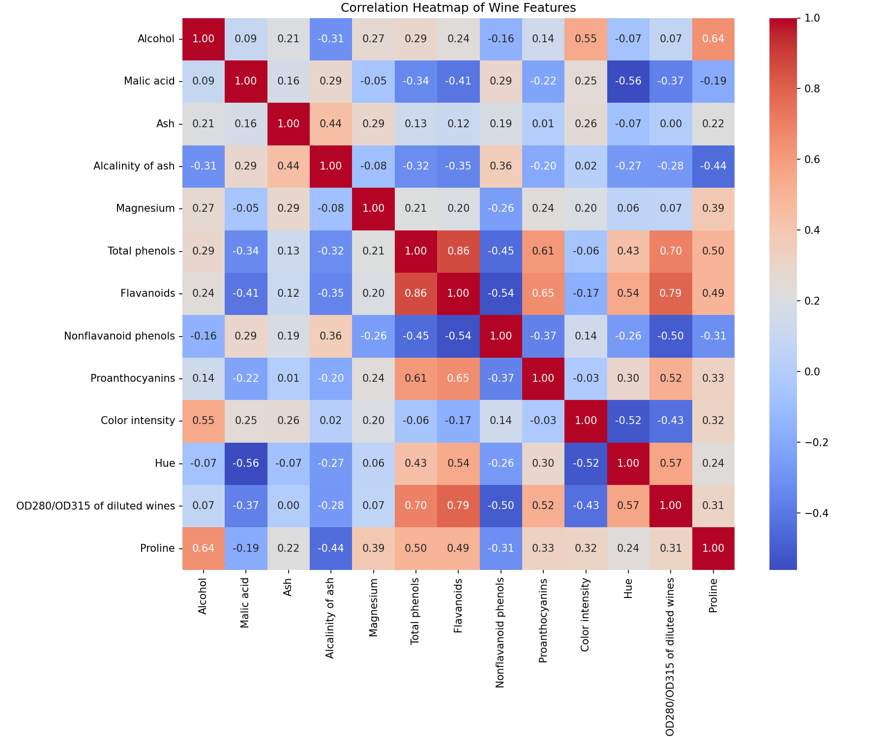
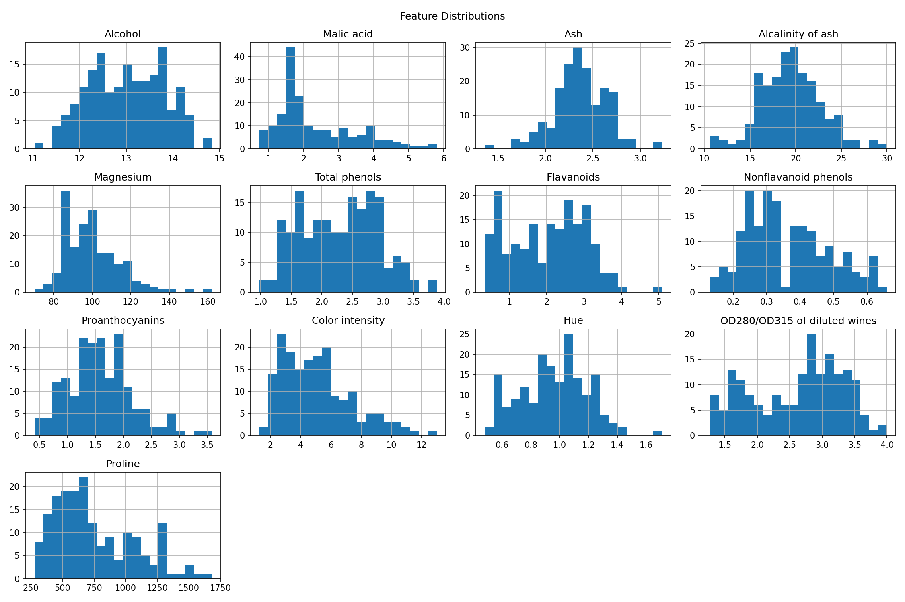
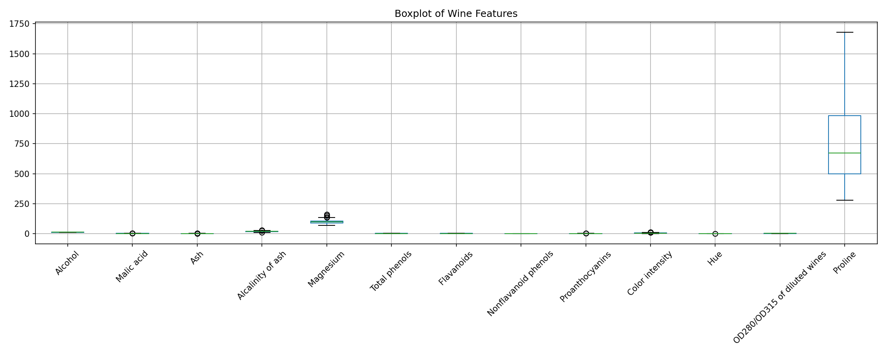

# Bước 1: Exploratory Data Analysis (EDA)

> **Trạng thái**: Hoàn thành  

---

## 1. Goal (Mục tiêu)
Phân tích đặc điểm phân phối, phát hiện giá trị thiếu, ngoại lệ và mối tương quan giữa các đặc trưng gốc để đánh giá mức độ dư thừa thông tin trước khi thực hiện PCA.

## 2. Input
- **Dataset**: `Wine dataset.csv`
- **Kích thước**: 178 mẫu, 13 đặc trưng đầu vào, 1 cột nhãn phân loại (`class`).

## 3. Tasks & Results (Công việc & Kết quả thực tế)
### Các công việc đã thực hiện:
1. Đọc dữ liệu và dọn dẹp khoảng trắng thừa trong tên cột.
2. Thống kê mô tả toàn diện (Mean, Std, Min, Max) của 13 đặc trưng.
3. Tính toán ma trận hệ số tương quan Pearson giữa các đặc trưng gốc.
4. Trực quan hóa phân phối bằng Histogram và phát hiện ngoại lệ bằng Boxplot.

### Kết quả thu được:
- **Phân phối nhãn lớp (class distribution):**
  - Class 2: 71 mẫu (39.9%)
  - Class 1: 59 mẫu (33.1%)
  - Class 3: 48 mẫu (27.0%)
- **Top các cặp đặc trưng có tương quan tuyến tính mạnh nhất:**
  - `Total phenols` <-> `Flavanoids`: **0.865** (Rất cao)
  - `Flavanoids` <-> `OD280/OD315 of diluted wines`: **0.787** (Cao)
  - `Total phenols` <-> `OD280/OD315 of diluted wines`: **0.700** (Cao)
  - `Flavanoids` <-> `Proanthocyanins`: **0.653** (Khá cao)
  - `Alcohol` <-> `Proline`: **0.644** (Khá cao)

## 4. Output & Visuals (Sản phẩm đầu ra)
### Ma trận tương quan:

*Nhận định cho ảnh:* Hệ số tương quan rất cao giữa `Total phenols` và `Flavanoids` (0.87) cùng với `Flavanoids` và `OD280/OD315` (0.79) chứng tỏ sự chồng chéo thông tin cực kỳ mạnh mẽ giữa các nhóm hóa chất này. Điều này chứng minh rằng việc giữ lại cả 13 chiều là dư thừa và PCA sẽ nén các chiều này rất tốt.

### Phân phối các biến gốc:

*Nhận định cho ảnh:* Các đặc trưng như `Alcohol`, `Ash`, `Alcalinity of ash` có dạng phân phối gần chuẩn (Gaussian-like). Tuy nhiên, một số biến khác như `Malic acid`, `Color intensity` bị lệch phải rõ rệt (right-skewed). Sự khác biệt lớn về hình dáng phân phối và biên độ giá trị này chứng minh việc chuẩn hóa dữ liệu trước khi thực hiện PCA là bắt buộc.

### Phát hiện các điểm ngoại lệ (outliers):

*Nhận định cho ảnh:* Xuất hiện một vài giá trị ngoại lệ đơn lẻ (outliers) nằm ngoài râu của boxplot ở các thuộc tính như `Malic acid`, `Magnesium`, `Alcalinity of ash` và `Proanthocyanins`. Vì các điểm ngoại lệ này không phải do sai số đo lường mà phản ánh biến động sinh học tự nhiên của các giống nho, chúng được giữ lại để đảm bảo tính tổng quát của mô hình.

## 5. Insight (Nhận định)
Dữ liệu tồn tại nhiều đặc trưng có mối tương quan tuyến tính rất mạnh với nhau (ví dụ: nhóm Phenols, Flavanoids, OD280/OD315). Điều này cho thấy thông tin bị dư thừa (redundancy) rất lớn, rất lý tưởng để áp dụng PCA nhằm nén thông tin và giảm số chiều đặc trưng.

## 6. Decision (Quyết định tiếp theo)
Chuyển sang **Bước 2: Data Cleaning** để kiểm tra tính toàn vẹn của dữ liệu và dọn dẹp outliers.

## 7. Artifacts (Danh mục lưu trữ)
- Biểu đồ tương quan & phân phối lưu tại thư mục `Figures/`.
