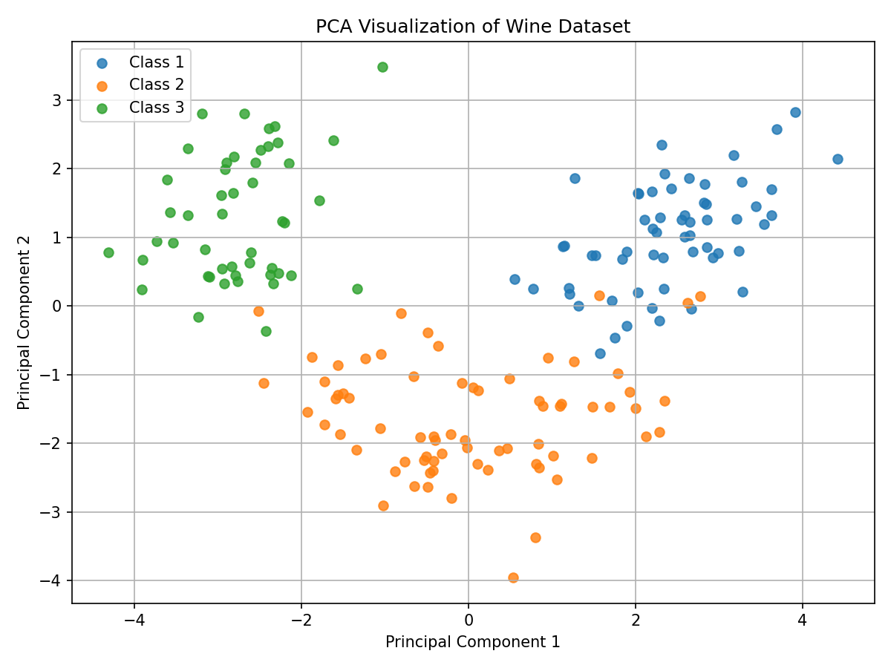

# Bước 6: PCA Fit & Component Selection

> **Trạng thái**: Hoàn thành  

---

## 1. Goal (Mục tiêu)
Huấn luyện mô hình PCA trên tập Train để tìm ra không gian 2 chiều tối ưu và thực hiện trực quan hóa cấu trúc dữ liệu theo 3 nhãn lớp trên mặt phẳng 2D.

## 2. Input
- Tập Train đã chuẩn hóa `X_train_scaled`.

## 3. Tasks & Results (Công việc & Kết quả thực tế)
### Các công việc đã thực hiện:
1. Khởi tạo thuật toán PCA với tham số `n_components=2`.
2. Tính toán trục chính (fit) trên tập Train và biến đổi cả hai tập Train/Test sang không gian mới.
3. Trực quan hóa dữ liệu trên biểu đồ Scatter Plot 2D theo nhãn lớp gốc.

### Kết quả thu được:
- **Kích thước dữ liệu sau giảm chiều:**
  - Train PCA shape: **(142, 2)**
  - Test PCA shape: **(36, 2)**
- **Nhận diện trực quan cấu trúc cụm trên mặt phẳng 2D:**
  - 3 nhóm rượu (Class 1, 2, 3) phân bố thành các cụm khá tách biệt rõ rệt.
  - Class 1 tập trung chủ yếu ở góc bên phải (PC1 dương).
  - Class 3 tập trung ở góc bên trái (PC1 âm).
  - Class 2 nằm trung gian ở giữa.

## 4. Output & Visuals (Sản phẩm đầu ra)
### Biểu đồ phân bổ dữ liệu trên 2 trục PC1 & PC2:

*Nhận định cho ảnh:* Trên mặt phẳng 2 chiều PC1 và PC2, các mẫu rượu tự động gom lại thành 3 cụm riêng biệt tương ứng với 3 lớp nhãn gốc mặc dù PCA là thuật toán học không giám sát (unsupervised). Cụm 1 (bên phải) và cụm 3 (bên trái) được phân tách cực kỳ rõ ràng, trong khi cụm 2 nằm ở giữa và có một lượng giao thoa nhẹ với cụm 3 ở biên.

- Bộ dữ liệu giảm chiều 2D (`X_train_pca`, `X_test_pca`).

## 5. Insight (Nhận định)
Chỉ với 2 thành phần chính, PCA đã giữ được sự phân tách cụm tự nhiên của dữ liệu rượu rất tốt. Điều này chứng minh 2 thành phần chính chứa đủ lượng thông tin cốt lõi để nhận diện các lớp rượu, mở ra cơ hội tối ưu hóa mô hình với số chiều cực thấp.

## 6. Decision (Quyết định tiếp theo)
Thực hiện phân tích phân bổ phương sai toàn diện ở **Bước 7: Hyperparameter Tuning** để đánh giá lượng thông tin bị mất.

## 7. Artifacts (Danh mục lưu trữ)
- Biểu đồ PCA Scatter Plot 2D lưu tại `Figures/`.
