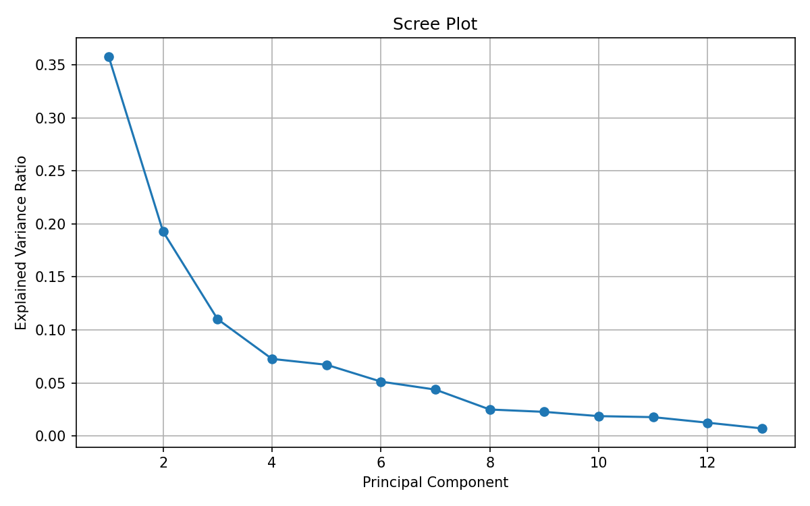
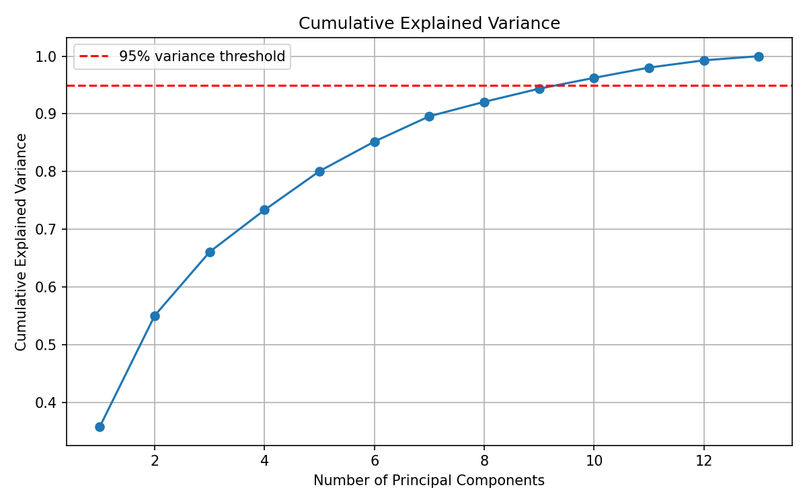

# Bước 7: Hyperparameter Tuning (n_components Selection)

> **Trạng thái**: Hoàn thành  

---

## 1. Goal (Mục tiêu)
Phân tích toàn bộ phương sai giải thích được của từng thành phần để tìm số lượng thành phần chính tối ưu giúp giữ lại ít nhất 95% thông tin gốc.

## 2. Input
- Ma trận đặc trưng `X_train_scaled`.

## 3. Tasks & Results (Công việc & Kết quả thực tế)
### Các công việc đã thực hiện:
1. Chạy mô hình PCA đầy đủ (13 components) để tính phương sai của từng trục.
2. Vẽ biểu đồ Scree Plot (phương sai của từng PC) và Cumulative Explained Variance (phương sai tích lũy).
3. Tìm điểm cắt đạt ngưỡng $\geq 95\%$ phương sai tích lũy.

### Kết quả thu được:
- **Phân bổ phương sai chi tiết từng thành phần chính (PCs):**
  - **PC1:** 35.79% (Lớn nhất)
  - **PC2:** 19.27% (Tổng 2 PC đầu đạt **55.06%**)
  - **PC3:** 11.02% (Tổng 3 PC đạt **66.08%**)
  - **PC4:** 7.27% (Tổng 4 PC đạt 73.35%)
  - **PC5:** 6.72% (Tổng 5 PC đạt 80.08%)
  - ...
  - **PC10:** 1.88% (Tổng 10 PC đạt **96.24%** - vượt ngưỡng 95%)
- **Số lượng components tối ưu để đạt $\geq 95\%$ phương sai tích lũy:** **10 components**.

## 4. Output & Visuals (Sản phẩm đầu ra)
### Biểu đồ Scree Plot (Tỷ lệ phương sai từng trục):

*Nhận định cho ảnh:* Biểu đồ Scree Plot cho thấy lượng phương sai giải thích giảm mạnh từ PC1 (35.79%) xuống PC2 (19.27%), sau đó có độ dốc thoai thoải dần và phẳng ra (điểm khuỷu tay - elbow point) bắt đầu từ PC3 (11.02%) và PC4 (7.27%). Điều này chỉ ra rằng 3 thành phần chính đầu tiên nắm giữ phần lớn cấu trúc thông tin quan trọng nhất của dữ liệu.

### Đường cong tích lũy phương sai giải thích:

*Nhận định cho ảnh:* Đường cong tích lũy phương sai biểu diễn lượng thông tin tăng dần khi thêm components. Chỉ với 2 PC đầu ta giữ được 55.06% thông tin, 3 PC giữ 66.08% thông tin. Để đạt được ngưỡng bảo toàn thông tin khắt khe là 95% (đường nét đứt màu đỏ), hệ thống cần giữ lại tối thiểu 10 thành phần chính (đạt 96.24% phương sai tích lũy).

## 5. Insight (Nhận định)
Điểm gập "Elbow point" trên Scree Plot xuất hiện rõ nét quanh PC3-PC4. Dữ liệu có sự phân mảnh thông tin khá nhiều ở các chiều sau: cần tới 10 components để giữ 95% thông tin gốc. Tuy nhiên, đối với bài toán phân loại tuyến tính, 2 hoặc 3 components đầu tiên có thể đã mang đầy đủ thông tin phân tách lớp (nhờ loại bỏ các biến nhiễu ở các PC sau).

## 6. Decision (Quyết định tiếp theo)
Tiến hành thực hiện phép giảm chiều chính thức ở **Bước 8: Final PCA Transformation**.

## 7. Artifacts (Danh mục lưu trữ)
- Biểu đồ Scree Plot & Cumulative Variance.
