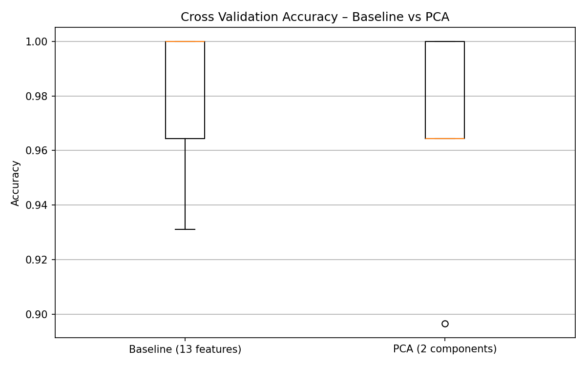

# Bước 10: Cross Validation

> **Trạng thái**: Hoàn thành  

---

## 1. Goal (Mục tiêu)
Đánh giá tính ổn định của không gian đặc trưng PCA 2 chiều bằng phương pháp kiểm chứng chéo K-Fold trên downstream model, so sánh trực tiếp với Baseline (13 features gốc).

## 2. Input
- Tập dữ liệu nén `X_train_pca`, tập gốc `X_train_scaled` và nhãn `y_train`.

## 3. Tasks & Results (Công việc & Kết quả thực tế)
### Các công việc đã thực hiện:
1. Cấu hình kiểm chứng chéo 5-Fold Stratified Cross Validation (shuffle=True).
2. Chạy CV trên tập Baseline (13 đặc trưng gốc) sử dụng Logistic Regression.
3. Chạy CV trên tập PCA (2 components) sử dụng cùng cấu hình Logistic Regression.
4. Thống kê giá trị Mean và Standard Deviation (Std) của Accuracy.

### Kết quả thu được:
- **Kết quả điểm số từng Fold (từ 1 đến 5):**
  - **Baseline (13 features):** 93.10%, 100.00%, 100.00%, 100.00%, 96.43%
  - **PCA (2 components):** 89.66%, 100.00%, 100.00%, 96.43%, 96.43%
- **Độ chính xác trung bình (Mean Accuracy ± Std):**
  - **Baseline CV:** **97.91% ± 2.77%**
  - **PCA CV:** **96.50% ± 3.78%**

## 4. Output & Visuals (Sản phẩm đầu ra)
### So sánh trực quan độ chính xác kiểm chứng chéo:

*Nhận định cho ảnh:* Biểu đồ hộp (Boxplot) cho thấy phân bố điểm chính xác kiểm chứng chéo của Baseline và PCA 2D cực kỳ sát nhau. Khoảng phân bố điểm số của Baseline hẹp hơn một chút (std 2.77%), trong khi PCA có độ phân tán rộng hơn nhẹ (std 3.78%) do mất mát 45% thông tin gốc. Tuy nhiên, giới hạn dưới của hộp PCA vẫn đạt gần 90% và đạt tối đa 100% độ chính xác ở nhiều fold, chứng minh tính ổn định cao của không gian giảm chiều.

## 5. Insight (Nhận định)
Độ chính xác trung bình của PCA chỉ thấp hơn Baseline đúng **1.41%** mặc dù đã bỏ đi tới 84.6% số chiều dữ liệu. Độ lệch chuẩn của PCA (3.78%) chỉ tăng nhẹ so với Baseline (2.77%), chứng minh các đặc trưng PC mới duy trì được tính ổn định và khả năng tổng quát hóa cực kỳ tốt trên các tập dữ liệu huấn luyện khác nhau.

## 6. Decision (Quyết định tiếp theo)
Thực hiện quét diện rộng toàn bộ số lượng components ở **Bước 11: Experiment Management**.

## 7. Artifacts (Danh mục lưu trữ)
- Biểu đồ Boxplot so sánh CV.
