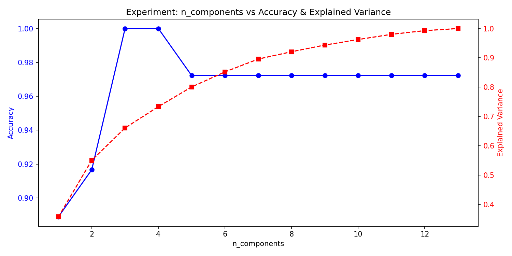

# Bước 11: Experiment Management

> **Trạng thái**: Hoàn thành  

---

## 1. Goal (Mục tiêu)
Theo dõi, quản lý và so sánh hiệu năng phân loại cùng lượng thông tin được bảo toàn khi quét số lượng components từ 1 đến 13 để tìm ra điểm "Sweet Spot" tối ưu nhất.

## 2. Input
- Dataset Split (`X_train_scaled`, `X_test_scaled`, `y_train`, `y_test`).

## 3. Tasks & Results (Công việc & Kết quả thực tế)
### Các công việc đã thực hiện:
1. Lập cấu hình quét (sweep) tham số `n_components` chạy từ 1 đến 13.
2. Đo lường Accuracy trên tập Test và tổng Explained Variance tương ứng với mỗi cấu hình.
3. Xuất kết quả ra file dữ liệu và vẽ biểu đồ tương quan trục kép (Dual-axis).

### Kết quả thu được:
- **Bảng theo dõi thí nghiệm quét số lượng components:**

| n_components | Accuracy | Explained Variance | Ghi chú |
| :---: | :---: | :---: | :--- |
| 1 | 88.89% | 35.79% | |
| **2** | **91.67%** | **55.06%** | Cấu hình được chọn để visualize 2D |
| **3** | **100.00%** | **66.08%** | **Sweet Spot (Accuracy tối đa)** |
| 4 | 100.00% | 73.35% | |
| 5 | 97.22% | 80.08% | |
| 6 -> 12 | 97.22% | 85.21% -> 99.28% | Điểm bão hòa |
| 13 | 97.22% | 100.00% | Tương đương Baseline gốc |

## 4. Output & Visuals (Sản phẩm đầu ra)
### Biểu đồ tương quan sweep tham số components:

*Nhận định cho ảnh:* Đồ thị trục kép biểu diễn rõ nét sự đánh đổi: Khi số lượng components (trục hoành) tăng lên, lượng phương sai tích lũy (đường nét đứt màu đỏ, trục bên phải) tăng tuyến tính đều đặn. Tuy nhiên, độ chính xác phân loại (đường màu xanh, trục bên trái) không cần tăng tuyến tính như vậy mà đạt đỉnh tuyệt đối **100% tại n = 3** (explained variance chỉ 66.08%), sau đó đi ngang và hơi giảm nhẹ ở n = 5 do xuất hiện các chiều chứa nhiễu.

- File dữ liệu ghi nhận lịch sử thí nghiệm: `experiment_results.csv`.

## 5. Insight (Nhận định)
Điểm tối ưu tuyệt đối (*Sweet Spot*) xuất hiện rõ rệt tại **$n=3$**. Với chỉ 3 thành phần chính (PC1, PC2, PC3) nắm giữ 66.08% phương sai, mô hình đã đạt độ chính xác kiểm thử tuyệt đối **100%**, vượt qua cả Baseline (13 features - 97.22%). Điều này chứng tỏ các PC phía sau (từ PC4 trở đi) chứa nhiều thành phần nhiễu (noise) đối với mô hình Logistic Regression; việc loại bỏ chúng giúp mô hình học tốt hơn.

## 6. Decision (Quyết định tiếp theo)
Xác thực ý nghĩa thống kê của các cải tiến này tại **Bước 12: Statistical Validation**.

## 7. Artifacts (Danh mục lưu trữ)
- Bảng kết quả `experiment_results.csv` và biểu đồ sweep.
