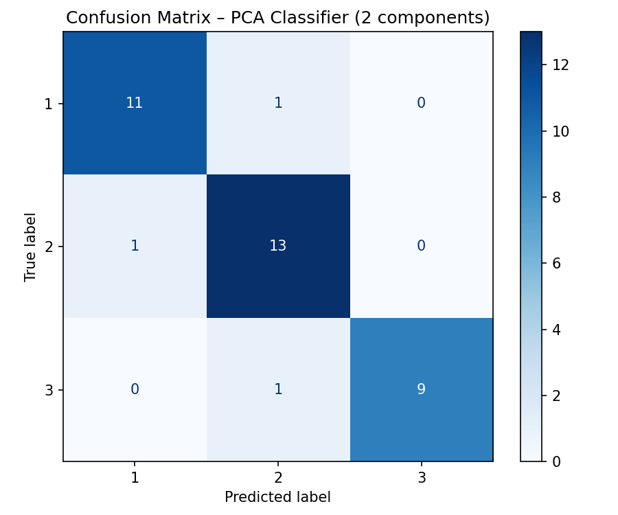

# Bước 13: Error & Reconstruction Analysis

> **Trạng thái**: Hoàn thành  

---

## 1. Goal (Mục tiêu)
Phân tích ma trận nhầm lẫn (Confusion Matrix) và xác định đặc điểm của các điểm dữ liệu bị phân loại sai trên không gian giảm chiều 2D để tìm cách cải thiện mô hình.

## 2. Input
- Nhãn thực tế `y_test`, nhãn dự báo `y_pred_pca` của mô hình PCA 2 chiều, ma trận tọa độ `X_test_pca`.

## 3. Tasks & Results (Công việc & Kết quả thực tế)
### Các công việc đã thực hiện:
1. Tính toán ma trận nhầm lẫn (Confusion Matrix) trên tập Test.
2. Lọc ra danh sách cụ thể các mẫu dữ liệu bị dự báo sai.
3. Phân tích tọa độ (PC1, PC2) của các mẫu lỗi này trên không gian PCA 2D.

### Kết quả thu được:
- **Độ chính xác phân loại của PCA (2 chiều):** **91.67%** (Dự đoán đúng 33/36 mẫu).
- **Chi tiết ma trận nhầm lẫn (Confusion Matrix):**
  - 1 mẫu thuộc **Class 1** bị dự báo nhầm sang **Class 2**.
  - 1 mẫu thuộc **Class 2** bị dự báo nhầm sang **Class 1**.
  - 1 mẫu thuộc **Class 3** bị dự báo nhầm sang **Class 2**.
- **Danh sách chi tiết 3 mẫu dự đoán sai:**

| Mẫu ID | PC1 | PC2 | Nhãn gốc (True) | Nhãn dự báo (Pred) | Phân tích lý do |
| :---: | :---: | :---: | :---: | :---: | :--- |
| Mẫu 1 | -2.427 | -0.369 | Class 3 | Class 2 | Nằm sâu trong vùng giao ranh giới cụm 3 và cụm 2 |
| Mẫu 2 | 1.566 | 0.158 | Class 2 | Class 1 | Nằm ở vùng biên giao thoa cụm 2 và cụm 1 |
| Mẫu 3 | 1.570 | -0.691 | Class 1 | Class 2 | Nằm ở vùng biên giao thoa cụm 1 và cụm 2 |

## 4. Output & Visuals (Sản phẩm đầu ra)
### Ma trận nhầm lẫn (Confusion Matrix):

*Nhận định cho ảnh:* Ma trận nhầm lẫn hiển thị phân phối kết quả dự đoán chéo. Đường chéo chính (màu xanh đậm) thể hiện số lượng mẫu phân loại chính xác vượt trội (11 mẫu Class 1, 13 mẫu Class 2, 9 mẫu Class 3). Các ô ngoài đường chéo chính chứa giá trị bằng 1 thể hiện 3 mẫu bị dự đoán sai nằm rải rác đều ở cả 3 lớp rượu.

- Bảng danh sách các điểm dữ liệu lỗi.

## 5. Insight (Nhận định)
Cả 3 mẫu bị lỗi đều có đặc điểm chung: tọa độ PC1 và PC2 của chúng nằm ngay tại **vùng biên giao thoa** giữa các cụm phân lớp trên đồ thị Scatter Plot. Khi nén dữ liệu từ không gian 13 chiều xuống 2 chiều, một số ranh giới quyết định tinh tế đã bị mất đi, dẫn đến việc ranh giới phân tách tuyến tính của Logistic Regression bị nhầm lẫn ở các điểm cực biên này.

## 6. Decision (Quyết định tiếp theo)
Chuyển sang **Bước 14: Model Interpretability** để phân tích đóng góp vật lý của các thuộc tính vào các trục PC.

## 7. Artifacts (Danh mục lưu trữ)
- Biểu đồ Confusion Matrix và danh sách các điểm dữ liệu lỗi.
