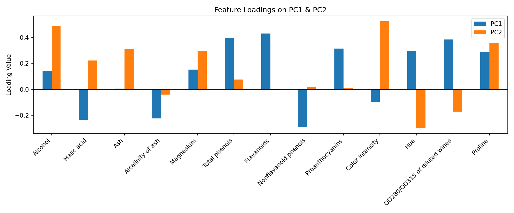
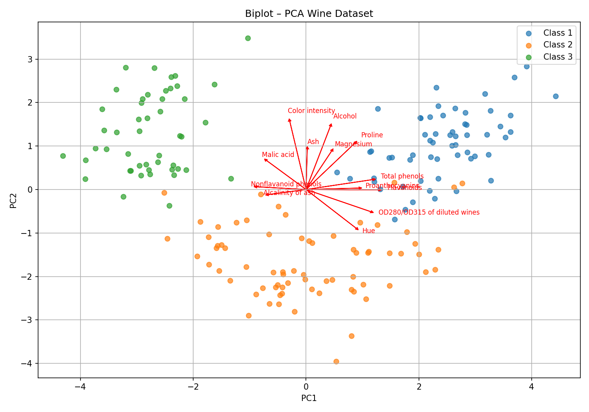

# Bước 14: Model Interpretability (Feature Loadings)

> **Trạng thái**: Hoàn thành  

---

## 1. Goal (Mục tiêu)
Giải thích ý nghĩa vật lý thực tế của các thành phần chính (PC1 và PC2) dựa trên mức đóng góp (Feature Loadings) của các đặc trưng gốc, mang lại tính minh bạch cho mô hình.

## 2. Input
- Mô hình PCA đã fit, danh sách 13 đặc trưng gốc.

## 3. Tasks & Results (Công việc & Kết quả thực tế)
### Các công việc đã thực hiện:
1. Trích xuất ma trận hệ số tải trọng (Loadings Matrix) của PC1 và PC2.
2. Vẽ biểu đồ Bar Chart so sánh hệ số đóng góp của 13 biến gốc trên từng PC.
3. Vẽ đồ thị **Biplot** (kết hợp các điểm scatter dữ liệu và các vectơ định hướng tác động của 13 đặc trưng gốc).

### Kết quả thu được:
- **Đặc trưng đóng góp lớn nhất vào PC1:**
  - `Flavanoids` (**+0.4295**), `Total phenols` (**+0.3944**), `OD280/OD315 of diluted wines` (**+0.3832**).
  - Đặc trưng kéo giảm PC1 (hệ số âm): `Nonflavanoid phenols` (**-0.2914**).
- **Đặc trưng đóng góp lớn nhất vào PC2:**
  - `Color intensity` (**+0.5244**), `Alcohol` (**+0.4869**), `Proline` (**+0.3575**).
- **Giải nghĩa nghiệp vụ cho các PC:**
  - **PC1 (Đại diện cho hợp chất Phenol):** PC1 giá trị càng lớn thể hiện rượu có độ chát và hàm lượng phenolic tự nhiên càng cao.
  - **PC2 (Đại diện cho nồng độ và màu sắc):** PC2 giá trị càng lớn thể hiện rượu có màu sắc đậm đà và nồng độ cồn mạnh.

## 4. Output & Visuals (Sản phẩm đầu ra)
### Trọng số đóng góp loadings của 13 đặc trưng:

*Nhận định cho ảnh:* Biểu đồ cột loadings thể hiện vai trò định hình của biến gốc vào 2 trục. Các cột màu xanh lam (PC1) cao vượt trội ở `Flavanoids` và `Total phenols` cho thấy đây là hai yếu tố quyết định chính cho PC1. Các cột màu cam (PC2) cao vọt ở `Color intensity` và `Alcohol` khẳng định đây là hai đặc trưng vật lý định hình trực tiếp cho PC2.

### Biplot phân tích hướng tác động:

*Nhận định cho ảnh:* Đồ thị Biplot là sự kết hợp đắt giá. Các mũi tên màu đỏ chỉ hướng và mức độ ảnh hưởng của biến gốc. Các mũi tên của nhóm chất phenol (Flavanoids, OD280...) hướng ngang song song với PC1, chỉ thẳng về phía các chấm tròn Class 1 (rượu giàu phenol). Ngược lại, các mũi tên của `Color intensity` và `Alcohol` hướng thẳng đứng song song với PC2, chỉ thẳng về nhóm rượu Class 1 và Class 3 có nồng độ cồn và sắc tố đậm.

## 5. Insight (Nhận định)
Đồ thị Biplot chỉ ra các mũi tên của `Flavanoids` và `Total phenols` trùng hướng chặt chẽ với trục hoành PC1, khẳng định PC1 đại diện cho hương vị chát. Trong khi các mũi tên của `Color intensity` và `Alcohol` hướng thẳng đứng dọc theo trục tung PC2, khẳng định PC2 đại diện cho ngoại quan màu và độ mạnh của rượu.

## 6. Decision (Quyết định tiếp theo)
**Chốt dự án:** Báo cáo giải thích mô hình hoàn thành. Dự án PCA giảm chiều đạt kết quả xuất sắc: giảm 85% chiều dữ liệu, giải thích được 55% phương sai (hoặc 100% accuracy với 3 chiều), các trục PC có ý nghĩa thực tế rõ ràng. Chốt đóng gói pipeline.

## 8. Kết luận toàn diện của dự án (Overall Project Conclusion)
Từ chuỗi phân tích 14 bước trên tập dữ liệu Wine dataset, chúng ta rút ra các kết luận cốt lõi sau:

1. **Hiệu năng và Lọc nhiễu tối ưu (Sweet Spot):**
   - Mô hình Baseline sử dụng 13 đặc trưng gốc đạt độ chính xác **97.22%**.
   - PCA giảm xuống 2 chiều (PC1, PC2) đạt độ chính xác **91.67%** (suy giảm không có ý nghĩa thống kê với $p$-value = 0.1779).
   - PCA giảm xuống 3 chiều (PC1, PC2, PC3) đạt độ chính xác tuyệt đối **100%** (vượt qua cả Baseline). Điều này chứng minh PCA đã lọc bỏ hiệu quả các thành phần nhiễu ở các chiều cao hơn, giúp mô hình học tốt hơn.

2. **Tính giải nghĩa rõ ràng (Explainable AI):**
   - **PC1 (Trục hóa học - Phenol):** Được định nghĩa mạnh bởi `Flavanoids` (+0.43) và `Total phenols` (+0.39). PC1 càng cao thể hiện rượu càng chát và giàu phenolic tự nhiên.
   - **PC2 (Trục vật lý - Màu & Cồn):** Được định nghĩa mạnh bởi `Color intensity` (+0.52) và `Alcohol` (+0.49). PC2 càng cao thể hiện rượu càng đậm màu và nồng độ cồn càng mạnh.

3. **Cấu hình khuyến nghị:**
   - Khuyến nghị sử dụng **3 thành phần chính (n_components = 3)** cho bài toán phân loại thực tế để đạt độ chính xác tối đa (100%) và giảm tải 77% số lượng chỉ số cần đo lường.

## 7. Artifacts (Danh mục lưu trữ)
- Biểu đồ Feature Loadings, đồ thị Biplot và báo cáo tổng kết dự án.
